# 🏨 The Wild Oasis - Hotel Management System

A full-featured hotel management system built for internal staff to manage bookings, rooms, sales, and user data efficiently and securely.
## Logo
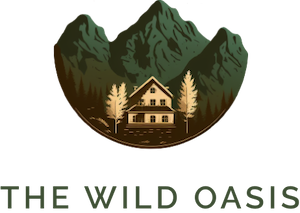
## 🚀 Live Demo

[Visit the Wild Oasis App](https://wiiild-oasis.netlify.app/login)(#) <!-- Replace with actual deployed link when available -->

## 📅 Project Duration

**March 2025 – May 2025**

---

## ✨ Features

- 🔒 **Secure User Management**  
  - Supabase-powered authentication & authorization.
  - Role-based access control for enhanced security.

- 📦 **Bookings & Rooms Management**  
  - Add, edit, delete, and view booking and room details.
  - Real-time updates using React Query.

- 📊 **Dashboard with Data Visualization**  
  - Interactive line and pie charts powered by Recharts.
  - Visual insights into bookings, revenue, and occupancy.

- 🌙 **Dark Mode Support**  
  - Toggleable dark mode UI using Styled-Components for a pleasant user experience.

- 🔍 **Powerful Table Operations**  
  - Pagination, filtering, and sorting for efficient data browsing and searching.

---

## 🛠️ Tech Stack

| Tech             | Description                                        |
|------------------|----------------------------------------------------|
| **React**        | Frontend library for building interactive UIs      |
| **Styled-Components** | CSS-in-JS styling with support for themes        |
| **Supabase**     | Backend-as-a-Service for auth & database services  |
| **React Query**  | Efficient data fetching, caching, and synchronization |
| **Recharts**     | Elegant charts for data visualization              |
| **Vite**         | Fast build tool and dev server                     |

---

## 📂 Folder Structure (Simplified)
src/
- ├── context / # global context
- ├── data/ # Uploader, images etc.
- ├── pages / # pages featured in the application
- ├── features/ # Feature-specific components like bookings, rooms
- ├── services/ # Supabase and API service functions
- ├── ui/ # Generic UI components (form, button, modal, etc.)
- ├── hooks/ # Custom React hooks
- └── App.jsx # Main application file
- ├── styles / #Global Styles
- ├── utils/ # important functions used in the application

## 📸 Screenshots
 ### Login
  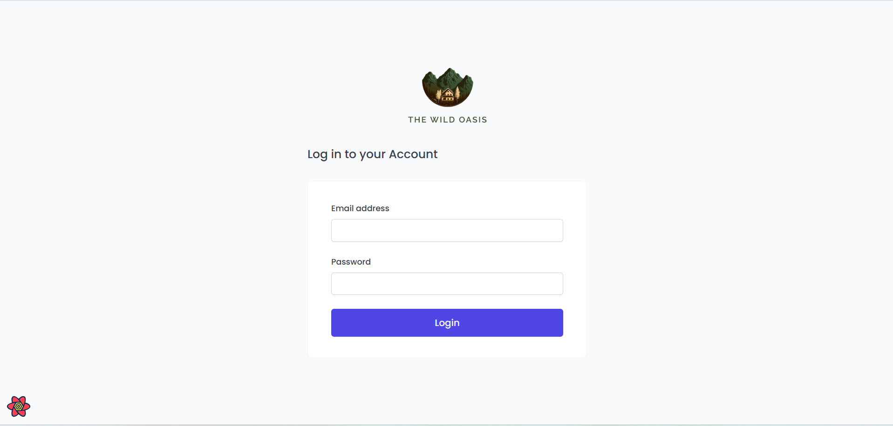
 ### Dashboard
 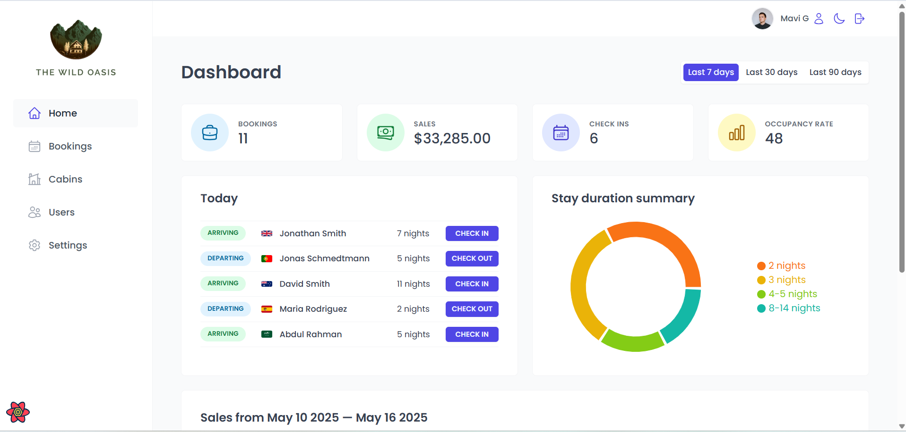
 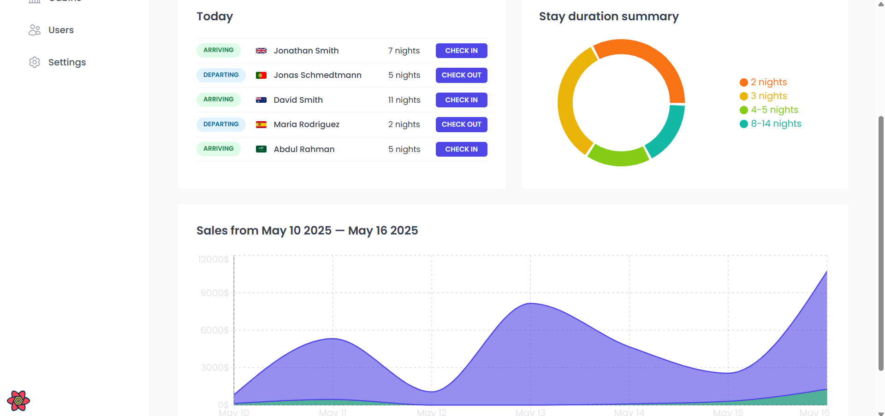
 ### Dashboard in Dark mode
 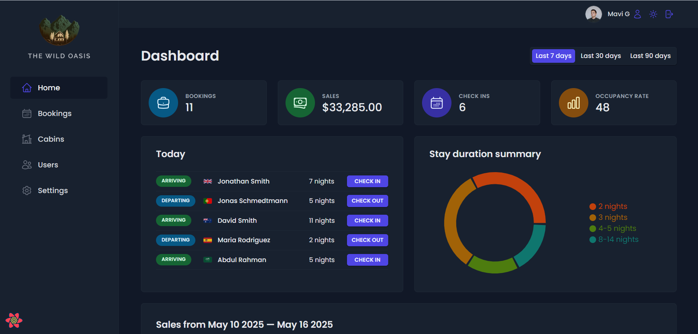
 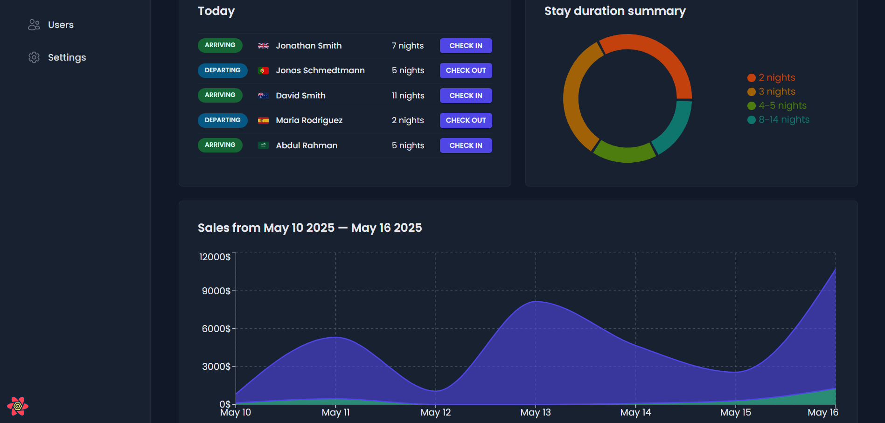
 ### Cabins
 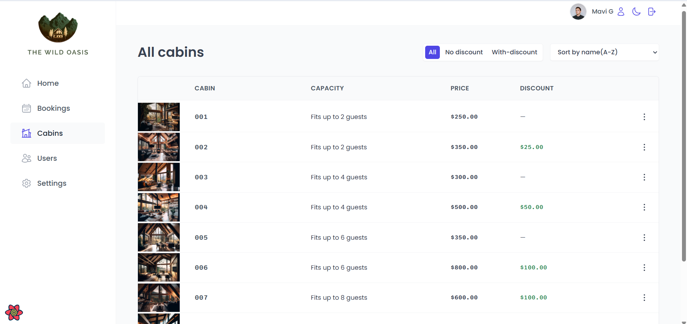
 ### Bookings
 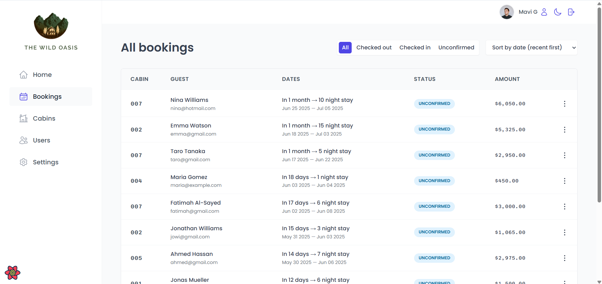
 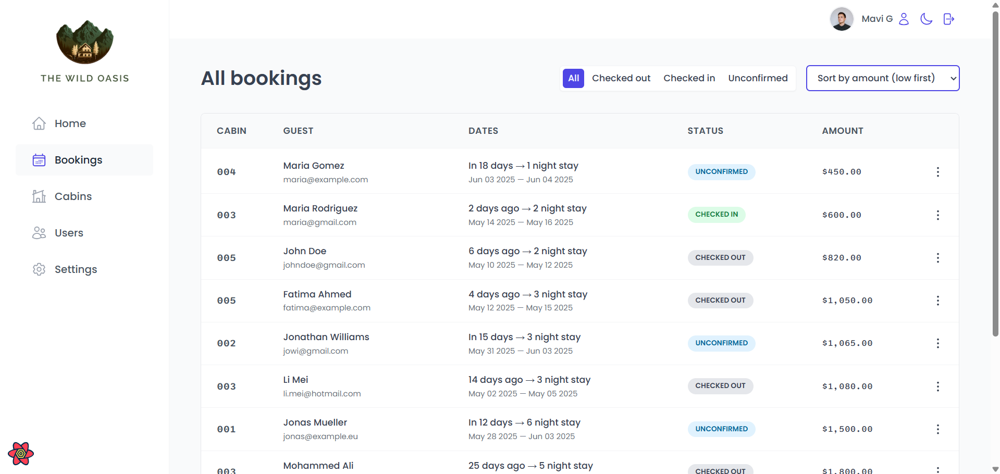
 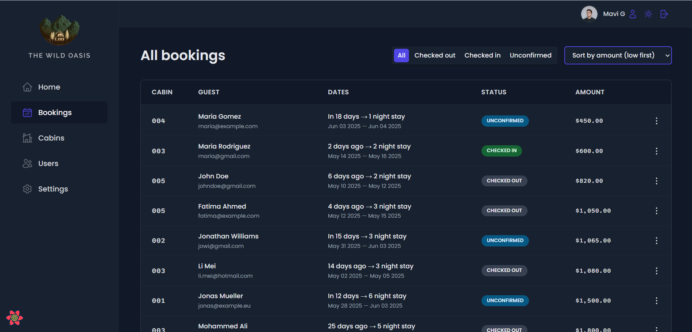
 ### Accounts
  
 ### User
  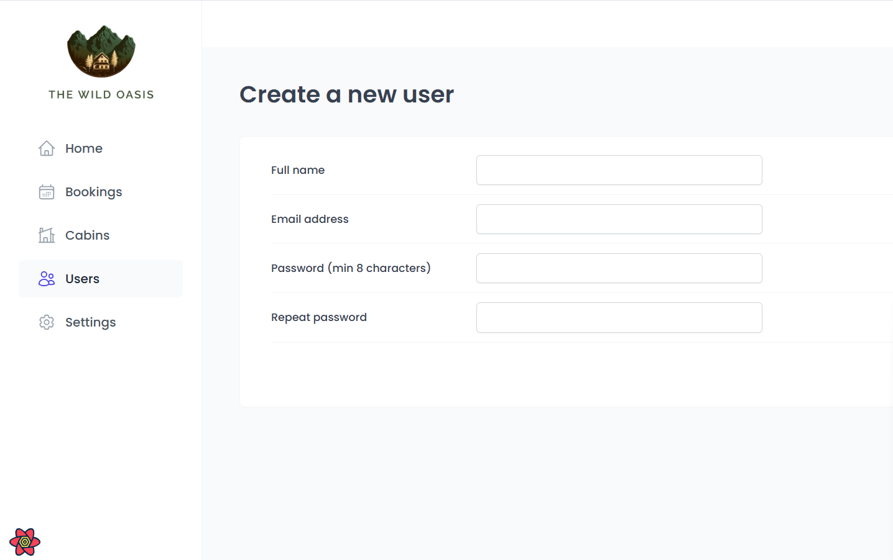
 ### Settings
 
  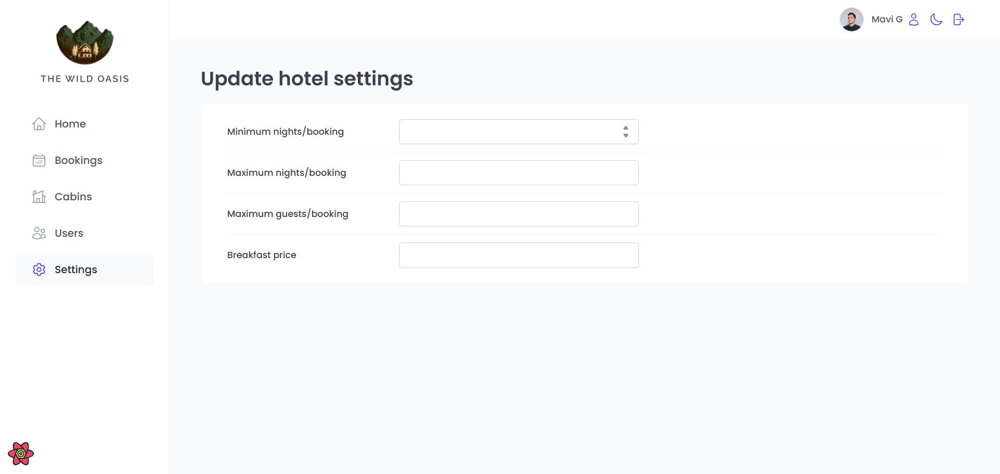

## ✅ Setup Instructions

 **Clone the Repository**
 -  Contributions are welcome! Please fork the repository and open a pull request.
 - git clone https://github.com/sandipmavi/the-wild-oasis.git
 - cd the-wild-oasis
### Install Dependencies
  npm install
### Set Up Supabase

 Create a project at Supabase

### Configure .env with your Supabase credentials:

- VITE_SUPABASE_URL=
- VITE_SUPABASE_ANON_KEY=your_anon_key
### Run the Development Server
npm run dev
## 🧠 Learnings
- Gained deep experience with React Query for real-world async data management.

- Mastered Supabase for implementing full-stack features without a custom backend.

- Designed a clean, responsive, and user-friendly UI using Styled-Components.

- Integrated dynamic charts and complex table features (filter/sort/paginate).

## 📌 Future Improvements
- Admin analytics dashboard with more KPIs.

- Customer-facing interface for self-booking.

- Role-specific dashboards (e.g., Receptionist vs. Manager).

## 🙌 Acknowledgements
- Inspired by the The Wild Oasis project concept by Jonas Schmedtmann.

## 🧑‍💻 Author
- Sandeep Mavi — linkedin.com/in/sandeep-mavi989/
- Email - smavi.dev@gmail.com

📄 License
This project is licensed under the MIT License.
